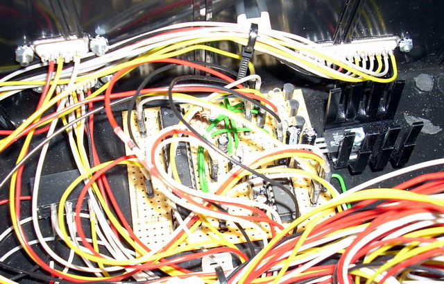

## Source code for project: [Serial interface module for emergency power off](https://link.stdout.no/g)

Reading voltage on the emergency power supply, and trigger power off with serial communication. Uses an AVR ATmega8 microcontroller.

Written in basic, using [Bascom-AVR](http://www.mcselec.com/).

### Author
[Thomas Jensen](https://thomas.stdout.no)
